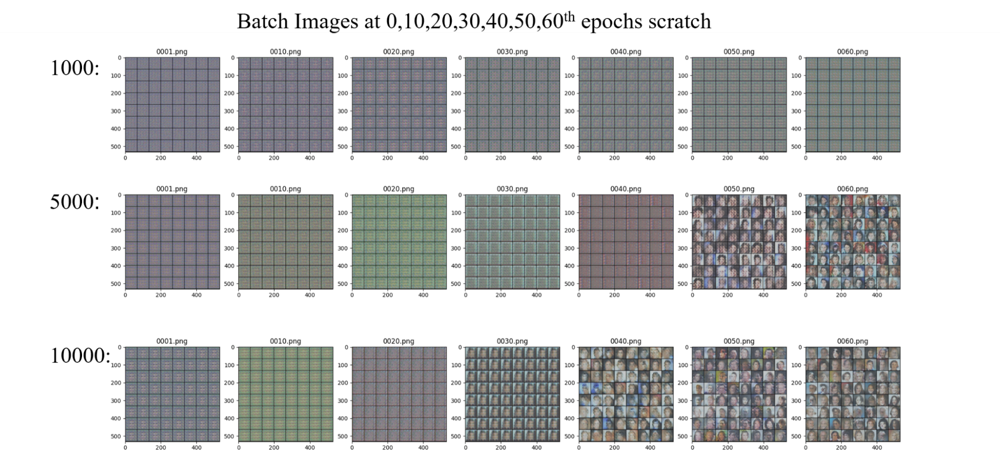

# GANs 101 and its Applications

[](https://mybinder.org/v2/gh/mayank-soni/GAN/HEAD)

This repository is for AI Singapore's AIAP Batch 12 Group Presentation Topic: "GANs 101 and its Applications".

In this repository, we generated fake celebrity images based on the [CelebA Dataset](https://mmlab.ie.cuhk.edu.hk/projects/CelebA.html) using 3 different Generative Adversarial Networks (GANs), namely,

- DCGAN (Deep Convolution GAN)
- WGAN (Wasserstein GAN)
- LSGAN (Least Squares GAN)

We also further explored the possibility of transfer learning on GANs in an attempt to reduce time and resources to train a model from scratch.

The results of our findings is briefly discussed below. Please refer to our [article](/docs/article.md) for the full details.

## Installation

There are 2 options:

1. Experiment this repository online using [Binder](https://mybinder.org/v2/gh/mayank-soni/GAN/HEAD)
2. Alternatively, you may clone this repository locally.

To run it locally, install relevant dependencies using one of the environment.yml files available.

- Use `environment-cuda.yml` for running PyTorch with CUDA.
- Use `environment-m1.yml` for run this repository on Apple Silicon.
- Additionally, `environment.lock.yml` is added to replicate the exact dependency tree while developing this repository on Windows.

```
# install conda environment
conda install --file environment-{arch}.yml

# activate conda environment
conda activate gan-101
```

## Usage

1. Open the Jupyter Notebook: `gan-on-celeba-dataset-wgan.ipynb`
2. Most of the configuration can be found on the second code block, specifically, different types of GANs can be experiment by setting the `MODE` as either `gan`, `lsgan` or `wgan`.
3. Set `TRANSFER_LEANRING` as `True` to enable transfer learning.

## Results

### DCGAN

DCGAN training results using 10000 samples with 60 epochs:

<div align="center">


</div>

### LSGAN

LSGAN training results using 10000 samples with 60 epochs:

<div align="center">


</div>

### WGAN

WGAN training results using 10000 samples with 60 epochs:

<div align="center">


</div>

### Transfer Learning

Comparing results from scratch with pretrained model with same hyperparameters such as learning rate and batch sizes.

Here is the result of LSGAN from scratch at different epochs:


Here is the result of LSGAN + Pretrained model using [vgg16_bn](https://pytorch.org/vision/main/models/generated/torchvision.models.vgg16_bn.html) at different epochs.


The pretrained model performs worse than the scratch model upon visual inspection, possibly due to differences between the source data and target dataset. Hyperparameter tuning may improve the pretrained model, and using a lower layer of vgg16_bn could be explored.

## Authors

This program is developed by apprentices from Batch 12 of AI Singapore's Apprenticeship Program, with contributions from the following people (in alphabetical order):

- [Mayank Soni](https://github.com/mayank-soni)
- [Quek Zhi Qiang](https://github.com/qzq92)
- [Soh Zhan Hong (Paul)](https://github.com/PaulSZH95)
- [Teng Kok Wai (Walter)](https://github.com/davzoku)

## References

- [[1406.2661] Generative Adversarial Networks](https://arxiv.org/abs/1406.2661)
- [[1511.06434] Unsupervised Representation Learning with Deep Convolutional Generative Adversarial Networks](https://arxiv.org/abs/1511.06434#)
- [[1701.00160] NIPS 2016 Tutorial: Generative Adversarial Networks](https://arxiv.org/abs/1701.00160)
- [[1611.04076] Least Squares Generative Adversarial Networks](https://arxiv.org/abs/1611.04076)
- [[1701.07875] Wasserstein GAN](https://arxiv.org/abs/1701.07875)
- [[1805.01677] Transferring GANs: generating images from limited data](https://arxiv.org/abs/1805.01677)
- [[1411.1792] How transferable are features in deep neural networks?](https://arxiv.org/abs/1411.1792)
- [CelebA Dataset](https://mmlab.ie.cuhk.edu.hk/projects/CelebA.html)
- [Understanding Generative Adversarial Networks (GANs) | by Joseph Rocca | Towards Data Science](https://towardsdatascience.com/understanding-generative-adversarial-networks-gans-cd6e4651a29)
- [How to Identify and Diagnose GAN Failure Modes - MachineLearningMastery.com](https://machinelearningmastery.com/practical-guide-to-gan-failure-modes/)
- [Review — LSGAN: Least Squares Generative Adversarial Networks (GAN) | by Sik-Ho Tsang | Medium](https://sh-tsang.medium.com/review-lsgan-least-squares-generative-adversarial-networks-gan-bec12167e915)
- [Improving Diffusion Models as an Alternative To GANs, Part 1](https://developer.nvidia.com/blog/improving-diffusion-models-as-an-alternative-to-gans-part-1/)

## Further Exploration

Check out the work from other groups too:

- [liong-t/aiap12_group1_sharing: AIAP Sharing Project Topic](https://github.com/liong-t/aiap12_group1_sharing)
- [AlvinNg89/AIAP-RAG-Chatbot: Chatbot for AI Singapore AI Apprenticeship Program](https://github.com/AlvinNg89/AIAP-RAG-Chatbot)
- [AIAP-Group-Sharing-5/Image-segmentation-using-U-Net](https://github.com/AIAP-Group-Sharing-5/Image-segmentation-using-U-Net)
