# GAN 101 and its Applications

By: Mayank Soni, Quek Zhi Qiang, Soh Zhan Hong, Teng Kok Wai

**Table of Contents**

- 1. [Introduction](#introduction)
- 2. [What are GANs?](#What-are-GANs)
  - 2.1. [Components](#Components)
  - 2.2. [Model details](#Model-Details)
    - 2.2.1. [CNNs in GANs](#CNNs-in-GANs)
    - 2.2.2. [Discriminator](#Discriminator)
    - 2.2.3. [Generator](#Generator)
  - 2.3. [Training](#Training)
  - 2.4. [Results](#Results)
- 3. [Challenges and Alternatives](#Challenges-and-Alternatives)
- 4. [Evaluation of Model Performance](#Evaluation-of-Model-Performance)
  - 4.1 [DCGAN loss function: Binary entropy](#DCGAN-loss-function-Binary-entropy)
  - 4.3. [LSGANs: Mean squared error loss function](#LSGANs-Mean-squared-error-loss-function)
  - 4.3. [WGANs: Wasserstein loss function](#WGANs-Wasserstein-loss-function)
- 5. [Comparison of Model Performance](#Comparison-of-Model-Performance)
- 6. [Transfer Learning for GANs](#Transfer-Learning-for-GANs)
  - 6.1. [Inspiration](#Inspiration)
- 7. [Implementation](#Implementation)
  - 7.1. [Results](#Results-1)
  - 7.2. [Takeaway](#Takeaway)
- 8. [Other Applications of GANs](#Other-Applications-of-GANs)
- 9. [Alternatives to GANs](#Alternatives-to-GANs)
- 10. [Conclusion](#Conclusion)
- 11. [References & Further Reading](#References-&-Further-Reading)

## Introduction

First introduced in 2014 by Ian J. Goodfellow and co-authors ([paper](https://arxiv.org/abs/1406.2661)), Generative Adversarial Networks (GANs) were a significant advance in the field of generative AI. They have typically been used for image generation, with the generated images both being used directly e.g. for illustration, as well as indirectly to augment labelled training data for other AI models. Beyond image generation, GANs can also be used for image translation, with CycleGANs (not explored in this article) able to translate aerial photos into maps, sketches into photo-realistic images, or even replace objects in images with other objects. GANs have even been used to generate realistic environments for the training of reinforcement learning agents. That said, while the focus has often been on images, GANs could theoretically be used to generate other sorts of data as well, although we won’t look into those in this article.

A GAN is a unique type of architecture consisting of two [neural networks](https://www.techtarget.com/searchenterpriseai/definition/neural-network) competing with each other, a generator network and a discriminator network (see details in [Section 2](#what-are-gans)). The two networks are trained together, albeit with opposing goals. However, once trained, they can be used independently.

<div align="center">

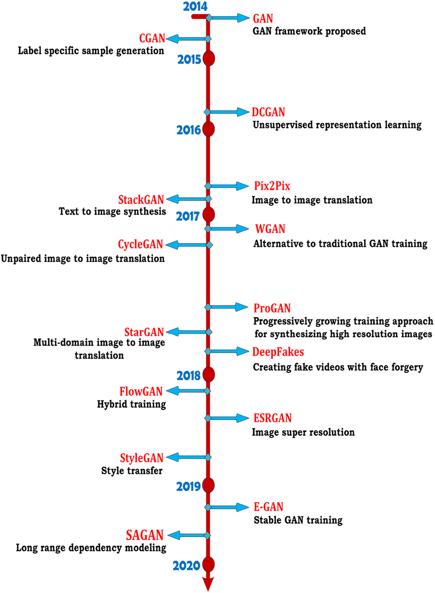

_Figure 1. Diagram from [International Journal of Multimedia Information Retrieval](https://www.researchgate.net/figure/Timeline-for-a-few-notable-GAN-models_fig6_344897558)_

</div>

Many variants on GAN models have been developed (see Figure 1) since GANs were first developed in 2014. Beside GANs, other techniques have and continue to be used for generative AI, including Boltzmann machines, variational auto-encoders, and most recently, transformers and diffusion models. In this article, we focus on Deep Convolutional GANs (DCGANs) for image generation, looking into various aspects of their training and performance.

## What are GANs?

In essence, a GAN comprises two main components: the generator and discriminator models. The two components have competing goals.

In particular, the generator aims to learn how to generate artificial data similar to real data to fool the discriminator. In contrast, the discriminator's goal is to distinguish clearly between the artificial and real data. An analogy would be how an art forger (generator) is trying to replicate the style of a master painter to fool a museum curator (discriminator) into accepting it as an actual artwork created by the master painter.

Let us dive deeper into the workings of a GAN. We will first cover the overall structure before discussing the workings of each component.

<div align="center">

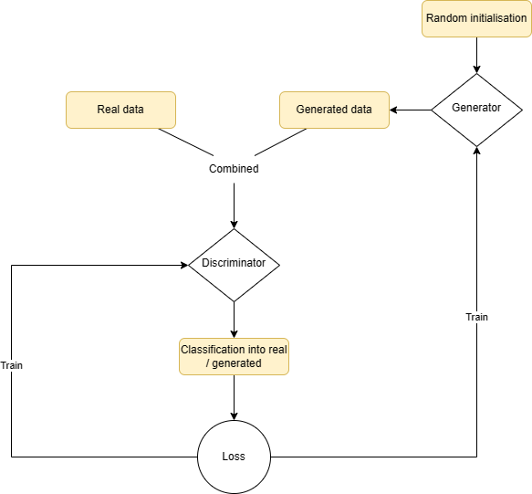

_Figure 2: Overview of GAN Architecture_

</div>

### Components

Going from top to bottom in Figure 2, we start with the input source. There are two input sources. The first is real data of the type that one would like the generator to learn to create. However, the generator never sees this data (otherwise, it would just copy it exactly!), and it only goes to the discriminator.

The other input source (indicated as “Random initialisation”, aka **latent vector**) is used by the generator to generate data to fool the discriminator. It is a sample from a pre-determined probability distribution (usually Gaussian with mean 0 and standard deviation 1, of size determined by the developer). Each sample serves as a seed for the generator to generate one artificial data point, and its randomness helps ensure the generated data points are different from each other.

Once the artificial data is generated, it is combined together with real data and passed to the discriminator, which attempts to classify each image into real or artificial. A loss function is calculated at the end of this process that measures the distance between the discriminator’s classification and the actual data labels. This loss is used to train the discriminator (to minimise the loss). Typically, the same loss function is then calculated on a batch of generated images, which is used to train the generator (to maximise the loss).

### Model Details

So what is inside the discriminator and generator components? This depends on the type of data being generated. For the most common task i.e. image generation, we typically use DCGANs. In these, both the generator and discriminator take the form of convolutional neural networks (CNNs). We assume that you understand the basic concepts involved in CNNs, and focus instead on how these are adapted to work with GANs. We also show an implementation of each of the models in PyTorch.

#### CNNs in GANs

This [paper](https://arxiv.org/pdf/1511.06434.pdf) describes some key design features for CNNs which are modified when working with DCGANs:

1. <span style="text-decoration:underline;">Replacing pooling layers with strided convolutions and deconvolutions</span>. CNNs typically use pooling layers to reduce high-dimensional images into a lower-dimensional feature space. While this works sufficiently well for many tasks, it can lead to loss of information on more detailed features, which is crucial for generating high-quality images or differentiating between images based on highly detailed features. Thus, GANs typically use strided convolutional and deconvolutional layers in the discriminator and generator respectively, which allow detailed features to be preserved better.
2. <span style="text-decoration:underline;">Not using fully connected hidden layers</span>: DCGANs typically do not use fully connected layers at the start or end of convolutional layers. These fully connected layers have a high number of parameters and slow down the training. They can also contribute to over-fitting. Instead, convolutional layers are used throughout.
3. <span style="text-decoration:underline;">Use of batch normalisation</span>: GANs can typically be unstable when trained (see [section 3 on challenges in GANs](#challenges-and-alternatives)). This is because both the generator and discriminator are being trained one after the other, and changes in one model can affect the performance of the other. Batch normalisation allows the GAN networks to be more resilient to such changes by normalising the output of each layer before it is passed to the next.
4. <span style="text-decoration:underline;">Not using biases in convolutional kernels</span>: One potential breakdown in GAN training can occur when the generator generates very similar data regardless of the latent vector, or the discriminator cannot discriminate between real and generated images and provide good feedback to the generator. Such issues are more likely to occur with bias parameters present in the models, since these biases apply at each convolution independently of the feature values passed in. Thus, GANs typically do not use biases in training.

#### Discriminator

The discriminator is an encoder model, using convolutional layers to identify features in images that help it discriminate between real and generated images. The architecture is flexible, with the main constraint being that the final output layer must be a single neuron with sigmoid activation that outputs the probability that each image is real. In addition, the LeakyReLU activation function is often used to avoid vanishing gradients over the discriminator layers. Please see below for an example implementation in PyTorch.

```python
discriminator = nn.Sequential(
    # in: 3x 64 x 64
    nn.Conv2d(3, 64, kernel_size=4, stride=2, padding=1, bias=False),
    nn.BatchNorm2d(64),
    nn.LeakyReLU(0.2, inplace=True),
    # out: 64 x 32 x 32

    nn.Conv2d(64, 128, kernel_size=4, stride=2, padding=1, bias=False),
    nn.BatchNorm2d(128),
    nn.LeakyReLU(0.2, inplace=True),
    # out: 128 x 16 x 16

    nn.Conv2d(128, 256, kernel_size=4, stride=2, padding=1, bias=False),
    nn.BatchNorm2d(256),
    nn.LeakyReLU(0.2, inplace=True),
    # out: 256 x 8 x 8

    nn.Conv2d(256, 512, kernel_size=4, stride=2, padding=1, bias=False),
    nn.BatchNorm2d(512),
    nn.LeakyReLU(0.2, inplace=True),
    # out: 512 x 4 x 4

    nn.Conv2d(512, 1, kernel_size=4, stride=1, padding=0, bias=False),
    # out: 1 x 1 x 1

    # Flatten to provide logit output (no fully connected layers)
    nn.Flatten(),
    # out: 1

    # To decide if a generated image is fake/real based on real image
    nn.Sigmoid() # Use nn.Linear(1,1) for LSGAN and WGAN
)
```

#### Generator

The generator is a decoder model, using de-convolutional layers to move from a randomly-generated latent space to an RGB image. ReLU is often used as the activation function to allow for more sparsity in the output layers (and not generate noisy images), with tanh is used as the final activation layer to obtain an image with pixel values from -1 to 1 (the real images also have to be transformed to this range before being passed to the discriminator - [see notebook](/gan-on-celeba-dataset-wgan.ipynb)). Please see below for an example implementation in PyTorch.

```python
generator = nn.Sequential(
    # input: latent vector of latent_size x 1 x 1

    nn.ConvTranspose2d(LATENT_SIZE, 512, kernel_size=4, stride=1, padding=0, bias=False),
    nn.BatchNorm2d(512),
    nn.ReLU(True),
    # out: 512 x 4 x 4

    nn.ConvTranspose2d(512, 256, kernel_size=4, stride=2, padding=1, bias=False),
    nn.BatchNorm2d(256),
    nn.ReLU(True),
    # out: 256 x 8 x 8

    nn.ConvTranspose2d(256, 128, kernel_size=4, stride=2, padding=1, bias=False),
    nn.BatchNorm2d(128),
    nn.ReLU(True),
    # out: 128 x 16 x 16

    nn.ConvTranspose2d(128, 64, kernel_size=4, stride=2, padding=1, bias=False),
    nn.BatchNorm2d(64),
    nn.ReLU(True),
    # out: 64 x 32 x 32

    nn.ConvTranspose2d(64, 3, kernel_size=4, stride=2, padding=1, bias=False),
    nn.Tanh()  # output is between -1 to 1
    # out: 3 x 64 x 64
)
```

### Training

The training process for GANs has been the subject of many studies, particularly the number of cycles for which to train the discriminator before training the generator. A good practice is to start at one cycle each and increase discriminator training cycles if there is mode collapse i.e. if the discriminator is stuck and unable to improve its discriminative capabilities fast enough to improve the generator (see more details in [section 3 on challenges in GANs](#challenges-and-alternatives)).

The code for the training loop is below, abstracting away the train_discriminator and train_generator functions, which are shown later. The discriminator and generator are trained once each for each batch of data. The discriminator is trained first to provide useful loss information when training the generator.

```python
def fit(epochs, lr, checkpoint_dir, start_idx = 1):
    torch.cuda.empty_cache()

    # Losses & scores
    losses_g = []
    losses_d = []
    real_scores = []
    fake_scores = []

    # Create optimisers, one for each model.
    # Set beta1 at 0.5 (default 0.9) to increase momentum and reduce likelihood of being stuck in local minimum.
    opt_d = torch.optim.Adam(discriminator.parameters(), lr=lr, betas=(0.5, 0.999))
    opt_g = torch.optim.Adam(generator.parameters(), lr=lr, betas=(0.5, 0.999))

    for epoch in range(epochs):
        # We don't use the second element in each batch, which represents metadata
        for real_images, _ in tqdm(train_dl):
            # Train discriminator for one cycle
            loss_d, real_score, fake_score = train_discriminator(real_images, opt_d)
            # Train generator for one cycle
            loss_g = train_generator(opt_g)

            # Record losses & scores
            losses_g.append(loss_g) # generator loss
            losses_d.append(loss_d) # discriminator loss
            real_scores.append(real_score) # discriminator avg probability on real data (higher is better score for discriminator)
            fake_scores.append(fake_score) # discriminator avg probability on fake data (higher is better score for generator)
        print("Epoch [{}/{}], loss_g: {:.4f}".format(epoch+1, epochs, loss_g) +
              ", loss_d: {:.4f}, real_score: {:.4f}".format(loss_d, real_score) +
              ", fake_score: {:.4f}".format(fake_score))
        # Save model weights and generated images after each epoch
        checkpoint(generator, checkpoint_dir, f'Generator_{epoch+1}')
        checkpoint(discriminator, checkpoint_dir, f'Discriminator_{epoch+1}')
        save_samples(epoch+start_idx, fixed_latent, show=False)
    save_metrics(model_dir, 'metrics.csv', 'Cycle', G_loss = losses_g,
                 D_loss = losses_d, Real_score = real_scores,
                 Fake_score = fake_scores)
    return losses_g, losses_d, real_scores, fake_scores
```

The train_generator and train_discriminator functions are shown below. One loop of training the discriminator involves calculating discriminator predictions for a batch of real images, then generating a batch of artificial images and calculating predictions for those. The sum of losses on both sets of images are used to update the discriminator weights.

This is followed by a loop of training the generator. This involves generating a new batch of artificial images, calculating discriminator predictions on them, and using this to update the generator weights.

You will notice that both generator and discriminator use the same binary cross-entropy (BCE) loss function (see [alternative loss functions and their impact in Section 4](#Evaluation-of-Model-Performance)). However, the ground truth values used to calculate BCE are reversed when training the discriminator vs when training the generator, since they have opposing objectives (see code below for implementation).

```python
def train_discriminator(real_images, opt_d):
    # Clear discriminator gradients
    opt_d.zero_grad()

    # Pass batch of real images through discriminator
    real_preds = discriminator(real_images)
    # Target = 1 i.e. real
    real_targets = torch.ones(real_images.size(0), 1, device=device)
    real_loss = F.binary_cross_entropy(real_preds, real_targets)
    # mean predicted probability of images being real (i.e. higher is better for discriminator)
    real_score = torch.mean(real_preds).item()

    # Generate batch of fake images
    latent = torch.randn(BATCH_SIZE, LATENT_SIZE, 1, 1, device=device)
    fake_images = generator(latent)

    # Pass fake images through discriminator
    # Target = 0 i.e. fake
    fake_targets = torch.zeros(fake_images.size(0), 1, device=device)
    fake_preds = discriminator(fake_images)
    fake_loss = F.binary_cross_entropy(fake_preds, fake_targets)
    # average probability predicted for fake images to be real (i.e. higher is better for generator)
    fake_score = torch.mean(fake_preds).item()

    # Update discriminator weights
    loss = real_loss + fake_loss
    loss.backward()
    # opt_d does not change generator weights even though they also have gradients.
    opt_d.step()
    return loss.item(), real_score, fake_score
```

```python
def train_generator(opt_g):
    # Clear generator gradients
    opt_g.zero_grad()

    # Generate batch of fake images
    latent = torch.randn(BATCH_SIZE, LATENT_SIZE, 1,1, device=device)
    fake_images = generator(latent)

    # Target set at 1 (even though images are fake), since we are training generator. So a prediction of 1 on fake images is good, and a prediction of 0 is bad.
    preds = discriminator(fake_images)
    targets = torch.ones(BATCH_SIZE, 1, device=device)
    loss = F.binary_cross_entropy(preds, targets)

    # Update generator. opt_g does not change discriminator weights even though they also have gradients.
    loss.backward()
    opt_g.step()

    return loss.item()
```

For more details, please see the full code in the [Github repository](https://github.com/mayank-soni/GAN).

### Results

We used the model above with the [CelebFaces Attributes Dataset (CelebA)](https://mmlab.ie.cuhk.edu.hk/projects/CelebA.html) dataset, a large-scale face attributes image dataset made available by the staff from the [Multimedia Laboratory, The Chinese University of Hong Kong](http://mmlab.ie.cuhk.edu.hk/), in 2016.

The images in the dataset cover large pose variations and background of celebrities and here are the details of the dataset:

- **10,177** **identities**,
- **202,599** **face images**, and
- **5 landmark locations**, **40 binary attributes** annotations per image.

We used the aligned and cropped images (with the focus on the faces) to train the model.

<div align="center">

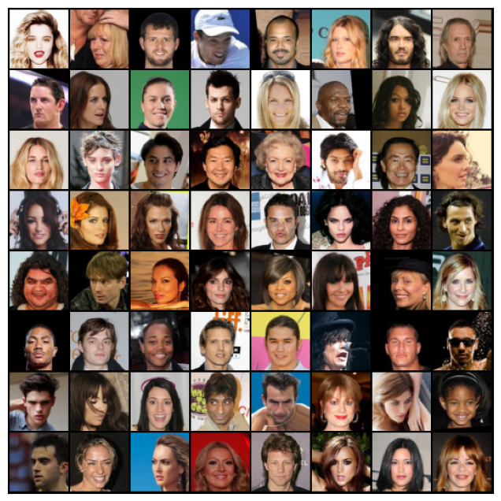

_Figure 3: Selection of images from CelebA dataset_

</div>

**Training conditions:**

- All images from dataset,
  - Resized image to 64 x 64 x 3 with centre crop applied of size 64 x 64
  - Normalised RGB channels to [-1, 1]
- 60 epochs of training
- Batch size 128
- Latent vector size dimension: 128 X 1 X 1

We used a fixed latent vector to generate a grid of images at the end of each epoch of training. As you can see, after just 1 epoch of training (1,583 cycles), the GAN was able to generate recognisably human faces. However, even after 60 epochs of training, the faces generated from the same latent vector, while clearly better, are not of good-enough quality to fool a human.

<div align="center">

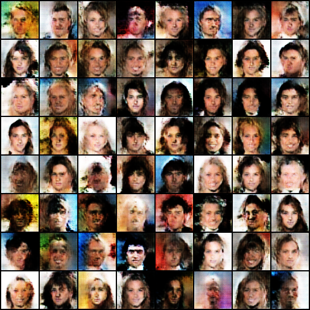

_Figure 4: Generated images after 1 epoch of training_

</div>

<div align="center">

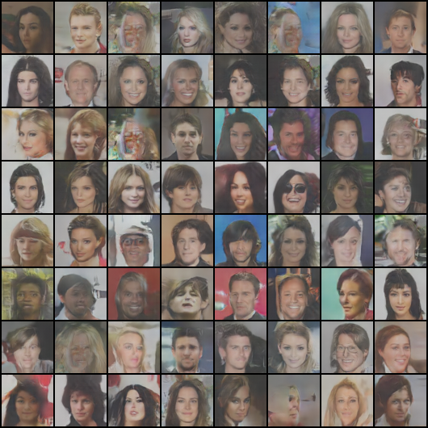

_Figure 5: Generated images after 60 epochs of training_

</div>

Looking at the graph of the generator loss and discriminator loss, we can see that the lowest generator loss was after ~ 4500 cycles or 3 epochs of training. Nevertheless, when looking at the images generated at this point (see Figure 6), it is clear that they are not as good as the images generated after 60 epochs. This aspect of the loss function is caused by the adversarial nature of GANs, since the generator loss is not just dependent on the quality of the generator but also on the quality of the discriminator. Thus, one cannot use generator loss alone as a measure of the quality of the generator. The same goes for discriminator loss.

<div align="center">

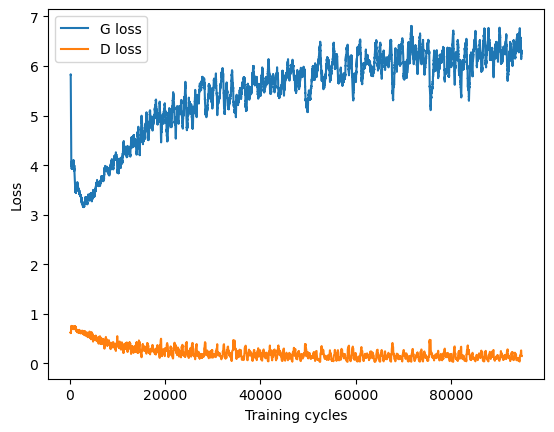

_Figure 6: Loss Function for generator and discriminator (rolling averages over 300 training cycles)_

</div>

<div align="center">

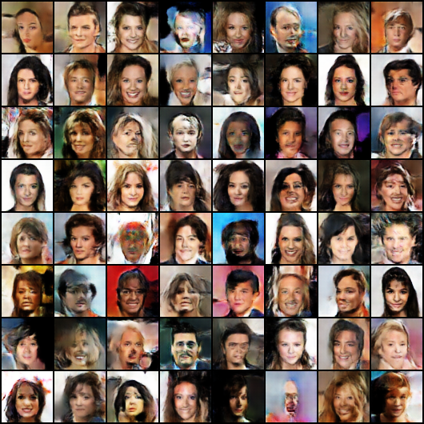

_Figure 7: Generated images after 3 epochs of training_

</div>

Looking now at training scores, this tells a similar story, where the discriminator trains faster than the generator and at the end of training, it is almost with 100% accuracy able to tell the generated and real images apart. Perhaps, with further training, the training scores might converge (i.e. both approach 0.5). For now though, we look into other variants of GANs.

<div align="center">

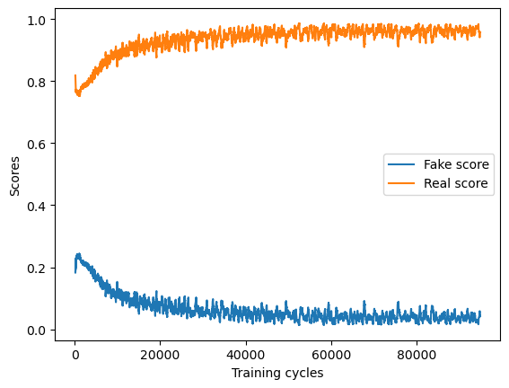

_Figure 8: Scores for generator and discriminator (rolling averages over 300 training cycles)_

</div>

## Challenges and Alternatives

Training GANs can be challenging. As such, many variants of GANs have been proposed, each with its strengths and weaknesses for different use cases. While the adversarial nature of the high-level architecture remains, GAN variants can use almost any structure to construct their generator and discriminator models. They also tweak the loss function, which is what we focus on in this article.

For comparison purposes, we have chosen 3 DCGANs using different loss functions, BCE loss which you have already seen, least squares (LS) loss, and Wasserstein (W) loss, with the differences shown in the table below.

<table>
  <tr>
   <td>
   </td>
   <td>DCGAN
   </td>
   <td>LSGAN
   </td>
   <td>WGAN
   </td>
  </tr>
  <tr>
   <td>Similarities
   </td>
   <td colspan="3" >Deep convolutional neural network layers in both generator and discriminator.
   </td>
  </tr>
  <tr>
   <td>Differences
   </td>
   <td>
   </td>
   <td>
   </td>
   <td>
   </td>
  </tr>
  <tr>
   <td>Loss function
   </td>
   <td>Binary cross-entropy loss function
   </td>
   <td>Least squares error (L2 error)
   </td>
   <td>Wasserstein distance
   </td>
  </tr>
  <tr>
   <td>Change in terminology
   </td>
   <td>-
   </td>
   <td>-
   </td>
   <td>Discriminator known as Critic
   </td>
  </tr>
  <tr>
   <td>Last layer of discriminator
   </td>
   <td>Sigmoid activation 
   </td>
   <td>Sigmoid activation replaced by a linear layer of 1 node
   </td>
   <td>Sigmoid activation replaced by a linear layer of 1 node
   </td>
  </tr>
  <tr>
   <td>Training process
   </td>
   <td>Discriminator followed by generator per cycle
   </td>
   <td>Discriminator followed by generator per cycle
   </td>
   <td>Discriminator is updated more frequently based on <em>number of critics set</em> followed by generator per cycle
   </td>
  </tr>
</table>

<div align="center">
<i>Table 1: Similarities and Differences of DCGAN, LSGAN and WGAN</i>
</div>

This brings us to 2 important concepts in GANs: **[Convergence failure](https://towardsdatascience.com/what-is-going-on-with-my-gan-13a00b88519e)** and **[Mode Collapse](https://wandb.ai/authors/DCGAN-ndb-test/reports/Measuring-Mode-Collapse-in-GANs--VmlldzoxNzg5MDk).**

Convergence failure in GANs refers to a situation where the generator and discriminator networks fail to converge to a stable equilibrium during training, which means that the generator network cannot generate data similar enough to real data to fool the discriminator or the discriminator is not able to distinguish between the real and fake data accurately enough to provide meaningful feedback to the generator.

On the other hand, mode collapse is when the generator model can only generate one or a small diversity of outcomes (‘modes’) based on its conclusion that a certain image style would always fool the discriminators.

<div align="center">

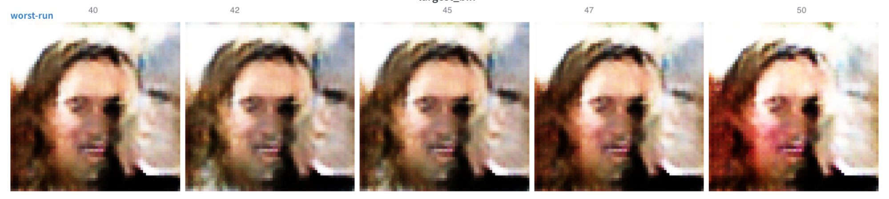

_Figure 9: Illustration of mode collapse from [Measuring Mode Collapse in GANs Using Weights & Biases](https://wandb.ai/authors/DCGAN-ndb-test/reports/Measuring-Mode-Collapse-in-GANs--VmlldzoxNzg5MDk)_

</div>

Both LS loss and W loss can help mitigate convergence failure and mode collapse typically faced by a BCE loss to some extent. The choice of regularisation techniques and hyperparameters can also significantly impact the training process to alleviate the common issues encountered in a GAN architecture.

The Python code snippet below show the different loss functions used.

```python
    if mode=='gan':
        real_loss = F.binary_cross_entropy(real_preds, real_targets)
        fake_loss = F.binary_cross_entropy(fake_preds, fake_targets)
        loss = real_loss + fake_loss
        # Combine loss and backward propagate
        loss.backward()
        opt_d.step()

    elif mode=='lsgan':
        # L2 loss function for discriminator involving (D(x) - b) and D(G(z))-a) where a is label for fake data and b is label for real data.

        mse_loss = torch.nn.MSELoss()
        real_loss = mse_loss(real_preds, real_targets)
        fake_loss = mse_loss(fake_preds, fake_targets)
        loss = 0.5 * (real_loss + fake_loss)

        loss.backward()
        opt_d.step()


    elif mode== 'wgan':
        # The discriminator doesn't really classify, but outputs a number (bigger for real than for fake) aka Critic loss. D(x) - D(G(z)). Since Discriminator needs to maximize this, it is equivalent to minimizing the negative of this.

        loss = -(real_preds.mean() - fake_preds.mean())
        loss.backward()
        opt_d.step()

        # Clip weights to be in a constrained value. This is to enforce the Lipschitz constraint on the critic's model loss function
        c = C


        # Clamp values to constrained range
        for p in discriminator.parameters():
            p.data.clamp_(-c, c)
```

## Evaluation of Model Performance

We continued to use the CelebA dataset to evaluate the performance of different GANs. Given the time and computing constraints encountered by the team, we could only afford to experiment with DCGANs, WGANs, LSGANs and the use of transfer learning. We also varied the number of images (1000, 5000 and 10000) used for training (kept at 60 epochs).

**<span style="text-decoration:underline;">Generated image visuals for DCGANs, LSGANs and WSGANs:</span>**

In general, with more images used, GAN models are able to generate better human face-like images as seen below, since there are more features to be extracted by the model itself. Here are some outputs of the generated image on the last (60th) epoch. Interestingly, DCGAN can still generate partially human-like images compared to LSGAN and WGAN with just a sample of 1000 images.

<table>
  <tr>
   <td>Number of Images
   </td>
   <td>1000
   </td>
   <td>5000
   </td>
   <td>10000
   </td>
  </tr>
  <tr>
   <td>Output of DCGAN generated image on last epoch
   </td>
   <td>

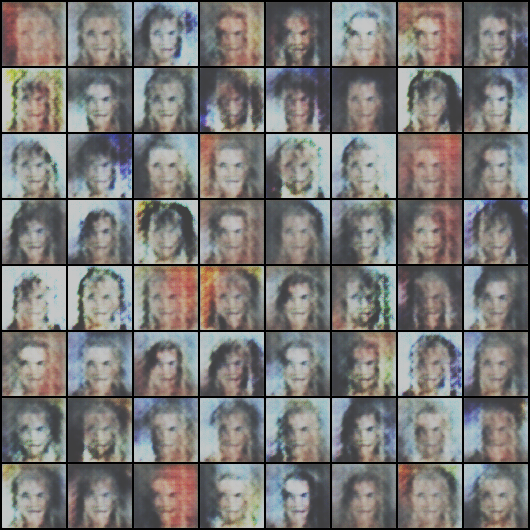

   </td>
   <td>


   </td>
   <td>


   </td>
  </tr>
  <tr>
   <td>Output of LSGAN generated image on last epoch
   </td>
   <td>


   </td>
   <td>

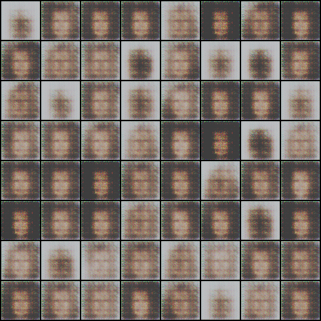

   </td>
   <td>


   </td>
  </tr>
  <tr>
   <td>Output of WGAN generated image on last epoch
   </td>
   <td>


   </td>
   <td>


   </td>
   <td>


   </td>
  </tr>
</table>

<div align="center">

<i>Table 2: Overall comparison of outputs of different GANs with different number of image input</i>

</div>

**<span style="text-decoration:underline;">Loss curves graph for DCGANs, LSGANs and WSGANs:</span>**

For each GAN, loss plots for discriminator and generator are plotted at per-cycle level (first loss graph for each GAN) as well as rolling mean of loss values over last 79 training cycles are provided (second loss graph for each GAN). This is to provide a different view of losses at different granularity levels which would indicate the general loss trend that was encountered in the process of training.

The use of 79 training cycles is not an arbitrary value chosen, but rather calculated based on total sample images (10000) divided by the number of batch samples (128) to represent the average losses at the epoch level.

#### DCGAN loss function: Binary entropy

- See [Section 2](#results) above.

<div align="center">


_Figure 10: DCGAN loss values for generator and discrimator using 10000 samples_

</div>

<div align="center">

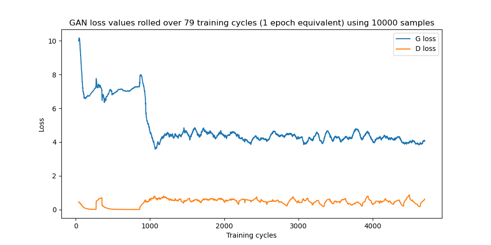

_Figure 11: DCGAN loss values rolled over 79 training cycles (1 epoch equivalent) using 10000 samples_

</div>

#### LSGANs: Mean squared error loss function

LSGANs, proposed in this [paper](https://arxiv.org/pdf/1611.04076.pdf), use the MSE loss function. This is seen as an improvement over the BCE loss function in situations of convergence failure where the discriminator is not able to discriminate between real and artificial images well, even though the artificial images are still far from the real images. In such cases, the BCE loss will not provide strong feedback to the generator since the artificial images which are identified as real have low BCE loss for the generator.

The MSE loss function, on the other hand, will continue to penalise generated images that, despite being identified as real, are still far from the real images. The generator training is therefore not as dependent on the quality of the discriminator.

<div align="center">

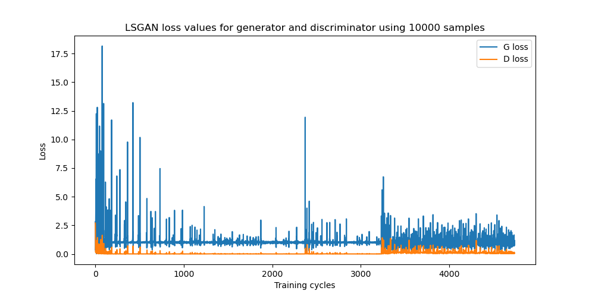

_Figure 12: LSGAN loss values for generator and discrimator using 10000 samples_

</div>

<div align="center">


_Figure 13: LSGAN loss values rolled over 79 training cycles (1 epoch equivalent) using 10000 samples_

</div>

#### WGANs: Wasserstein loss function

_Note: The discriminator used in WGAN is known as critic._

The Wasserstein loss function was proposed in this [paper](https://arxiv.org/pdf/1701.07875.pdf) and derives from the earth mover distance between two distributions. It was designed to avoid saturated losses in DCGAN, where the discriminator is easily able to detect the artificial images and thus the loss function saturates i.e. improvements to the generator are not able to improve the loss function significantly and gradients generated are low.

<div align="center">

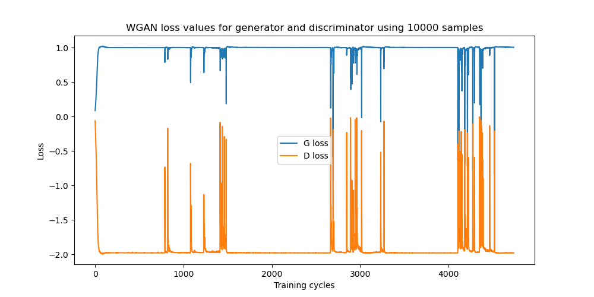

_Figure 14: WGAN loss values for generator and discrimator using 10000 samples_

</div>

<div align="center">


_Figure 15: WGAN loss values rolled over 79 training cycles (1 epoch equivalent) using 10000 samples_

</div>

## Comparison of Model Performance

Based on the training graphs for DCGAN, where it can be seen that the discriminator is able to easily distinguish real and generated images, and the generator is not able to train fast enough to fool the discriminator, it would seem as if WGANs might provide a better alternative. Here is a comparison of DCGAN and WGAN in image generation presented in GIF format.

<div align="center">


_Figure 16: DCGAN Image Generation_

</div>

<div align="center">


_Figure 17: WGAN Image Generation_

</div>

From the loss graphs above for the three GAN variants, the loss values are generally stable with smaller fluctuations in terms of magnitude for LSGAN and WGAN as compared to DCGAN. In the first loss plot above, the generator loss gradually decreases from a value range of 7-8 to 5-6 as the training cycle progresses towards the 1000 mark.

In terms of loss values movement involving DCGAN/WGAN, the loss movements across epoch values are opposite of each other, which indicates that the improvement of loss for either generator/discriminator comes at the expense of the other as expected, since the loss is to be minimised for generator and maximised for discriminator. In contrast, LSGAN involves the minimization of loss functions for both generator and discriminator.

As the epoch used across the GANs described above are fixed, we are unable to conclude if setting a higher epoch value would reveal any possibility of loss value convergence/model collapse for each of the GAN variant models as described by this [article](https://sh-tsang.medium.com/review-lsgan-least-squares-generative-adversarial-networks-gan-bec12167e915).

## Transfer Learning for GANs

Transfer learning is a machine learning technique in which a model trained on one task is utilised as a starting point for another related task. In the context of GANs, transfer learning can involve using a pre-trained generator or discriminator as a starting point for a new GAN.

### Inspiration

Our inspiration originates from a 2018 [paper](https://arxiv.org/abs/1805.01677), where a [ResNet](https://pytorch.org/hub/pytorch_vision_resnet/) was incorporated as an architecture for GAN. A homogeneous transfer learning was used where researchers first train their discriminator and generator on the ImageNet dataset, and then use them in a GAN trying to imitate the LSUN dataset (with varying sample sizes from LSUN to imitate learning from a low-resource dataset). On all sample sizes, the pre-trained models were found to give better images with clearer defined details. They also found that pre-training the discriminator was much more important than pre-training the generator.

As pre-training a model from scratch would have been too resource-intensive, we instead used an out-of-the-box pre-trained classifier.

We also sought inspiration from a 2014 [paper](https://arxiv.org/abs/1411.1792) on how transferable models could be across contexts. A general trend the researchers observed is that for heterogeneous transfer learning (where the source data and target data are extremely different), using lower layers of the pre-trained models would give better results. As per previous section, we see LSGAN and WGAN as having poorer performance than DCGAN. As an experimental implementation, we compare LSGAN from scratch with LSGAN + transfer learning using [torchvision vgg16-bn](https://pytorch.org/vision/main/models/generated/torchvision.models.vgg16_bn.html), taking only the first 22 layers of the model.

## Implementation

Implementation is done on LSGAN discriminator with all hyperparameters such as learning rate and batch sizes to be the same. LSGAN from scratch uses 15 layers while LSGAN + Pretrain uses the first 22 freezed layers from vgg16_bn pretrained feature extractors with 5 additional training layers.

**Refer to following code to use only 22 layers of vgg16_bn feature extractors:**

```python
import torchvision.models as models

vgg16 = models.vgg16_bn()
for param in vgg16.features.parameters():
    param.require_grad = False
pretrained_layers = list(vgg16.features)[:22]
```

**Adding pretrain extractors to critic and discriminator:**

```python
import torchvision.models as models

vgg16 = models.vgg16_bn()
for param in vgg16.features.parameters():
    param.require_grad = False
pretrained_layers = list(vgg16.features)[:22]

customised_layers_disc = [
    nn.MaxPool2d(kernel_size=2, stride=2, padding=0, dilation=1, ceil_mode=False),
    nn.Conv2d(256, 512, kernel_size=4, stride=2, padding=1, bias=False),
    nn.BatchNorm2d(512),
    nn.LeakyReLU(0.2, inplace=True),
    # out: 512 x 4 x 4

    nn.Conv2d(512, 1, kernel_size=4, stride=1, padding=0, bias=False),
    # out: 1 x 1 x 1

    # Flatten to provide output whether is it 1 or 0
    nn.Flatten(),

    # To decide if a generated image is fake/real based on real image
    nn.Sigmoid()
]

customised_layers_critic = [
    nn.MaxPool2d(kernel_size=2, stride=2, padding=0, dilation=1, ceil_mode=False),
    nn.Conv2d(256, 512, kernel_size=4, stride=2, padding=1, bias=False),
    nn.BatchNorm2d(512),
    nn.LeakyReLU(0.2, inplace=True),
    # out: 512 x 4 x 4

    nn.Conv2d(512, 1, kernel_size=4, stride=1, padding=0, bias=False),
    # out: 1 x 1 x 1

    # Flatten to provide output whether isit 1 or 0
    nn.Flatten(),

    # To output a value (like regression)
    nn.Linear(1,1)
]

discriminator = nn.Sequential(
    *(pretrained_layers + customised_layers_disc)
)

critic = nn.Sequential(
    *(pretrained_layers + customised_layers_critic)
)
```

A visual comparison can be seen as follows:

**Models trained from scratch:**

<div align="center">


_Figure 18: Result of LSGAN discriminator trained from scratch_

</div>

**Models trained with vgg16_bn as pretrained layers:**

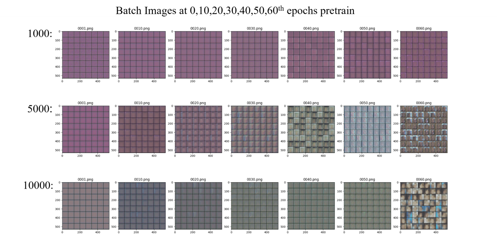
_Figure 18: Result of LSGAN discriminator pretrained from VGG16_bn_

### Results

A visual inspection shows that the pretrained variant performs worse than the model from scratch. A possibility may be due to a large dissimilarity of the vgg16 source data and the celebA dataset of target.

### Takeaway

As per the 2014 paper on how transferable models could be, vgg16_bn has essentially trained as a general classifier model making its source data and outputs to be very dissimilar from our use case. More effort could be placed in the hyperparameter tuning of the pretrained model. An experiment of using an even lower layer of vgg16 may be explored.

## Other Applications of GANs

In our example above, we have shown how easily we can implement our own GANs to generate synthetic celebrity images and this is just one of the many applications that GANs is capable of.

Below are some notable examples in various applications:

**Image generation and video synthesis:** We can use [CycleGANs](https://github.com/junyanz/CycleGAN) for image-to-image translation tasks, [StyleGANs](https://github.com/NVlabs/stylegan) for control of image style, and [BigGANs](https://github.com/ajbrock/BigGAN-PyTorch) to improve image quality to higher resolutions.

**Text-to-image generation:** Images can be generated from text descriptions. This has virtual reality and game design applications. [StackGAN](https://github.com/hanzhanggit/StackGAN) uses a two-stage GAN architecture to generate high-quality images from text descriptions.

**Speech Synthesis:** Speech can be generated from text. This has applications in virtual assistants and text-to-speech systems. One example is [WaveGAN](https://github.com/chrisdonahue/wavegan), which uses a GAN-based approach to generate high-fidelity speech signals from noise.

There has been significant progress in the development of GANs, and we recommend checking out the following GitHub repository to stay up with the latest developments:

- [nightrome/really-awesome-gan](https://github.com/nightrome/really-awesome-gan)
- [hindupuravinash/the-gan-zoo](https://github.com/hindupuravinash/the-gan-zoo)
- [nashory/gans-awesome-applications](https://github.com/nashory/gans-awesome-applications)

## Alternatives to GANs

While GANs have been popular for generative AI applications, there are other alternatives that can be considered for your next generative AI project. Industry leaders like Nvidia have coined these considerations as the “Generative Learning Trilemma”.

<div align ="center">


_Figure 20: Generative Learning Trilemma Diagram from [Improving Diffusion Models as an Alternative To GANs, Part 1](https://developer.nvidia.com/blog/improving-diffusion-models-as-an-alternative-to-gans-part-1/)_

</div>

A good generative model should meet the following conditions:

- **High-Quality Sampling:** We want images that look as natural as the authentic images as possible
- **Mode coverage and sample diversity:** We want variety in our generated images
- **Fast Sampling:** We want the image generation to be as quick as possible

While GANs are generally efficient at generating high-quality images relatively quickly, other models, such as [Variational Autoencoders (VAEs)](https://towardsdatascience.com/understanding-variational-autoencoders-vaes-f70510919f73) and [Diffusion Models](https://lilianweng.github.io/posts/2021-07-11-diffusion-models/), may offer different advantages.

VAEs, for instance, learn a compressed representation of the input data in the form of a latent space, which is then used to generate new data points. In contrast, GANs generate new data by directly learning the training data distribution. VAEs are often good at quick sampling, mode coverage, and sample diversity, but not high-quality sampling. This is because VAEs rely on a probabilistic decoder network, which generates samples by sampling from the learnt latent space, resulting in fuzzy or less detailed samples.

The salient feature between GANs and diffusion models is that diffusion models learn a sequence of transformations that maps a simple distribution to the target distribution, which is used to generate new data by iteratively applying the learned transformations to a sample from the simple distribution, whereas GANs learn to generate new data by optimising a generator network to produce realistic data that is difficult to distinguish from the training data. Diffusion models are generally strong at high-quality sampling, mode coverage, and sample variety but not so good at quick sampling. The number of transformations in the sequence is often large (e.g. hundreds or even thousands), leading to a significant computational overhead during training and inference.

It is worth noting that there has been much research into combining several architectures such as [VAE-GAN](https://arxiv.org/abs/2201.07387), [ARGAN](https://openreview.net/forum?id=rJWrK9lAb), and [Diffusion-GAN](https://arxiv.org/abs/2206.02262) to leverage the strengths of different models to improve their overall performance.

## Conclusion

We have demonstrated the ease of creating GANs to generate synthetic face images and explored the possibilities of using transfer learning to enhance their performance. GANs are a critical part of generative AI and have been the subject of much research, leading to numerous variants of their architecture that go beyond image generation. As generative AI continues to expand, new techniques and approaches are being developed. When addressing specific use cases, it is important to consider the strengths and weaknesses of different variants of GANs or even consider other alternatives like VAEs. By leveraging the power of generative AI, we can unlock new possibilities for a wide range of applications.

## References & Further Reading

- [[1406.2661] Generative Adversarial Networks](https://arxiv.org/abs/1406.2661)
- [[1511.06434] Unsupervised Representation Learning with Deep Convolutional Generative Adversarial Networks](https://arxiv.org/abs/1511.06434#)
- [[1701.00160] NIPS 2016 Tutorial: Generative Adversarial Networks](https://arxiv.org/abs/1701.00160)
- [[1611.04076] Least Squares Generative Adversarial Networks](https://arxiv.org/abs/1611.04076)
- [[1701.07875] Wasserstein GAN](https://arxiv.org/abs/1701.07875)
- [[1805.01677] Transferring GANs: generating images from limited data](https://arxiv.org/abs/1805.01677)
- [[1411.1792] How transferable are features in deep neural networks?](https://arxiv.org/abs/1411.1792)
- [CelebA Dataset](https://mmlab.ie.cuhk.edu.hk/projects/CelebA.html)
- [Understanding Generative Adversarial Networks (GANs) | by Joseph Rocca | Towards Data Science](https://towardsdatascience.com/understanding-generative-adversarial-networks-gans-cd6e4651a29)
- [How to Identify and Diagnose GAN Failure Modes - MachineLearningMastery.com](https://machinelearningmastery.com/practical-guide-to-gan-failure-modes/)
- [Review — LSGAN: Least Squares Generative Adversarial Networks (GAN) | by Sik-Ho Tsang | Medium](https://sh-tsang.medium.com/review-lsgan-least-squares-generative-adversarial-networks-gan-bec12167e915)
- [Improving Diffusion Models as an Alternative To GANs, Part 1](https://developer.nvidia.com/blog/improving-diffusion-models-as-an-alternative-to-gans-part-1/)
